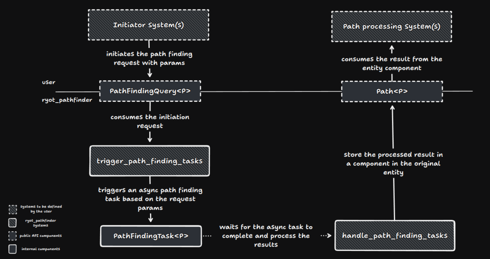

# Ryot PathFinder

`ryot_pathfinder` is a high-performance, asynchronous pathfinding library optimized for 2D environments, specifically
designed for integration with the Bevy game engine. It efficiently supports complex pathfinding operations and is ideal
for games and simulations that demand dynamic navigation capabilities. It
uses [Pathfinding](https://docs.rs/pathfinding/latest/pathfinding/) under the hood to provide a robust and reliable
integration with Bevy's ECS.

## Capabilities

- **Seamless Bevy Integration**: Built to work hand-in-hand with Bevy's ECS, offering smooth integration and ensuring
  compatibility with Bevy's event systems.
- **Asynchronous Operations**: Utilizes async tasks to maintain high performance and responsiveness, particularly
  suitable for scenarios with extensive pathfinding demands.
- **2D Optimization**: Specially tailored for 2D grid-based navigation, providing robust tools for tile-based and
  open-world game environments.
- **Extensible Architecture**: Designed to be flexible, allowing developers to extend and customize pathfinding logic to
  fit specific game requirements.

## Features

This crate includes an optional feature, `"ryot_tiled"`, which integrates with the `ryot_tiled` crate to support
tiled-2D specific pathfinding systems. This feature extends the pathfinding capabilities to work seamlessly with tiled
maps, adding valuable functionality for games using tile-based layouts.

## Getting Started

Before setting up the pathfinder, lets understand the two core concepts of the pathfinder: `Pathable<P>`
and `Navigable<N>`.

### Pathable

The Pathable trait represents the position in the world. It's used to calculate the path between two points. The trait
requires the implementation of the `generate` method, which returns a pathable position based on (x, y, z),
a coordinates method that returns the coordinates of the pathable position, and a path_to method that calculates the
path to another pathable position.

### Navigable

The Navigable trait belongs to `ryot_core` and is used to determine if a point is navigable or not. Currently, it
has two navigation conditions in a dimensional space: `is_walkable` and `blocks_sight`. The trait requires the
implementation of the `is_walkable` and `blocks_sight` methods, which return a boolean value based on the navigable
condition. The trait has an `append` method that appends the navigable value to another navigable value.

It also requires the implementation of the `is_default` method, which returns true if that implementation
corresponds to the default value (useful to skip unnecessary calculations).

### Basic Setup

To integrate `ryot_pathfinder` you need to add a pathable to your Bevy app. This is done by calling the `add_pathable`
method on your Bevy app builder. A pathable is represented by a pair of Pathable and Navigable implementations <P, N>.

Here is a basic example with the pre-defined Pathable and Navigable implementations from `ryot_tiled`:

```rust
use ryot_pathfinder::prelude::*;
use bevy::prelude::*;

fn setup(mut commands: Commands) {
    commands.spawn().insert(PathFindingQuery::default());
}

fn main() {
    App::build()
        .add_plugins(DefaultPlugins)
        .add_pathable::<TilePosition, Flags>()
        .run();
}
```

### Components

The `PathFindingQuery` has three main components:

#### `PathFindingQuery<P>`

This component is attached to entities that require a pathfinding computation. It specifies the parameters for the
pathfinding algorithm:

- **to**: target position.
- **cardinal_cost**: cost of moving in the cardinal directions.
- **diagonal_cost**: cost of moving in the diagonal directions.
- **success_distance**: distance from the target position that is considered a successful pathfinding computation.
- **timeout**: maximum time in seconds that the pathfinding algorithm can run before returning None.

It's part of the public API and should be used by the user to trigger pathfinding computations.

#### `PathFindingTask<P>`

This component is attached to entities that are currently computing a pathfinding algorithm. It holds the future (or
task) that will return the path result. It's internal to ryot_pathfinder and cannot be used by the user.

#### `Path<P>`

This component is attached to entities that have completed a pathfinding computation. It holds the result of the
path finding computation, the actual path that the entity can follow to reach the target.

It's part of the public API and should be used by the user to move the entity along the path.

### Workflow

The flow happens in four steps:

1. `PathFindingQuery<P>` is added to the entity, specifying the parameters for the pathfinding algorithm.
2. `PathFindingQuery<P>` is consumed by `trigger_path_finding_tasks` system, which creates a `PathFindingTask<P>` and
   attaches it to the entity.
3. `PathFindingTask<P>` is executed asynchronously, and once it completes, the `handle_path_finding_tasks` system
   creates
   a `Path<P>` component and attaches it to the entity.
4. The `Path<P>` can now be consumed by the user to move the entity along the path.

To better understand how `PathFindingQuery<P>`, `PathFindingTask<P>`, and `Path<P>` interact, check the diagram below:


## Examples

Choose an example to run based on your needs, such as handling multiple entities or dealing with obstacles:

```bash
cargo run --example example_name
```

Replace example_name with the name of the example you wish to run.

#### Understanding the Examples

Each example included in the library showcases different aspects of the pathfinding system:

- **Basic**: Demonstrates the simplest form of pathfinding.
- **Multiple**: Handles multiple actors navigating simultaneously.
- **Obstacles**: Integrates static obstacles within pathfinding calculations.

#### Experimenting with Advanced Scenarios

As you grow more comfortable, explore more complex examples like stress tests or integration with tile-based systems:

- **Tiled***: Utilizes the `ryot_tiled` feature to perform pathfinding on a tiled map, using TilePosition and Flags.
- **Stress Test***: Evaluates the pathfinder's performance under high load conditions.

Those examples require the `"ryot_tiled"` feature to be enabled.

#### Building Your Own Scenarios

Leverage the `ExampleBuilder` to customize and create tailored pathfinding scenarios:

```rust
fn main() {
    ExampleBuilder::<P/* custom pathable type */, N/* custom navigable type */>::new()
        .with_grid_size(/* custom dimension of a squared grid, default 10 */)
        .with_n_entities(/* number of actors to spawn, default 10 */)
        .with_n_obstacles(/* number of obstacles to spawn, default 0 */)
        .with_max_distance(/* maximum distance to calculate pathfinding, default 10 */)
        .with_sleep(/* sleep time (ms) between consuming pathfinding results, default 100 */)
        .with_navigable(/* custom navigable (N) value for obstacles, default N::default() */)
        .with_query_builder(/* custom query builder, default PathFindingQuery::new(pos).with_success_distance(0.) */)
        .drawing_app()
        .run();
}
```

## Benchmarks

Performance benchmarks are included to provide insights into the crate's efficiency. The benchmark bench can be run to
evaluate performance under various conditions:

```bash
cargo bench --features ryot_tiled
```

### Results

| Test Name                    | Size | Time (ns/iter) | Variability (± ns) | Iterations per Second (iters/s) |
|------------------------------|------|----------------|--------------------|---------------------------------|
| bench_2_sized_path_finding   | 2    | 137            | 2                  | 7,299,270                       |
| bench_3_sized_path_finding   | 3    | 166            | 2                  | 6,024,096                       |
| bench_5_sized_path_finding   | 5    | 285            | 6                  | 3,508,772                       |
| bench_10_sized_path_finding  | 10   | 1,131          | 73                 | 884,148                         |
| bench_15_sized_path_finding  | 15   | 3,272          | 188                | 305,709                         |
| bench_20_sized_path_finding  | 20   | 7,139          | 691                | 140,088                         |
| bench_with_obstacles         | 20   | 40,044         | 4,442              | 24,973                          |
| bench_30_sized_path_finding  | 30   | 21,406         | 831                | 46,726                          |
| bench_50_sized_path_finding  | 50   | 81,027         | 5,558              | 12,343                          |
| bench_75_sized_path_finding  | 75   | 225,945        | 86,525             | 4,424                           |
| bench_100_sized_path_finding | 100  | 445,268        | 241,426            | 2,246                           |

This README format clearly sections out the features, example usage, and benchmarks, providing a comprehensive guide for
anyone looking to integrate the `ryot_pathfinder` crate into their projects.

## License

`ryot_pathfinder`, as well as the whole `ryot` framework, is released under the GNU-APGLv3 license. For more
information, the [license](LICENSE) file is available in this crate.